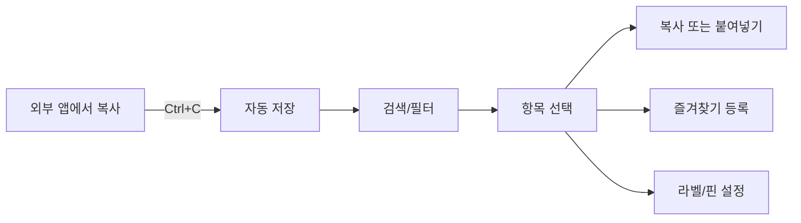

# 📋 클립보드 파일럿 (Clipboard Pilot)

<div align="center">


**Windows용 스마트 클립보드 관리 도구 🚀**

*클립보드 히스토리를 자동 저장하고 강력한 검색으로 언제든 찾아 사용하세요!*

[기능](#-주요-기능) • [설치](#-설치-방법) • [사용법](#-사용법) • [개발](#-개발-가이드) • [기여](#-기여하기)

</div>

---

## 🎯 소개

**클립보드 파일럿**은 Windows 클립보드의 모든 내용을 자동으로 저장하고 관리하는 강력한 생산성 도구입니다. 

복사한 내용을 잃어버린 경험이 있으신가요? 며칠 전 복사한 텍스트를 다시 찾으려고 애쓴 적이 있으신가요? 
클립보드 파일럿이 이 모든 문제를 해결해드립니다!

> ⚠️ **중요**: 이 소프트웨어는 개인, 교육, 연구 목적으로만 무료로 사용할 수 있습니다. 
> 상업적 사용은 별도 라이선스가 필요합니다. 자세한 내용은 [라이선스](#-라이선스) 섹션을 참조하세요.

### ✨ 핵심 기능

- 🔄 **자동 수집**: 모든 클립보드 데이터를 자동으로 저장 (텍스트, 이미지, HTML, 파일 등)
- 🔍 **강력한 검색**: 키워드로 빠르게 검색하고 다양한 필터로 정확히 찾기
- ⭐ **즐겨찾기**: 자주 사용하는 항목을 `Ctrl+Alt+1~9`로 즉시 호출
- 📌 **핀 고정**: 중요한 항목은 상단에 고정하여 항상 접근 가능
- 🎨 **컬러 라벨**: 7가지 색상으로 항목을 시각적으로 분류
- 🖼️ **이미지 지원**: 이미지 자동 저장 및 썸네일 생성
- ⚡ **전역 단축키**: 어떤 앱에서든 `Ctrl+Shift+V`로 미니 패널 호출
- 🎨 **모던 UI**: DevExpress 기반의 세련되고 직관적인 인터페이스
- 🔒 **프라이버시**: 로컬 SQLite 데이터베이스에만 저장 (인터넷 불필요)

---

## 📸 스크린샷

> *스크린샷은 첫 릴리스 후 추가됩니다*

```
[메인 창 스크린샷]
[미니 패널 스크린샷]
[설정 창 스크린샷]
```

---

## 🚀 주요 기능

### 📥 스마트 클립보드 수집

- **다양한 형식 지원**: 
  - 📝 일반 텍스트 (Text)
  - 🌐 HTML 콘텐츠
  - 📄 RTF (Rich Text Format)
  - 🖼️ 이미지 (PNG, JPG, BMP 등)
  - 📁 파일 및 폴더 목록
  
- **중복 방지**: 동일한 내용이 10초 내 다시 복사되면 자동으로 필터링
- **민감정보 보호**: 비밀번호 패턴 자동 감지 및 필터링
- **용량 관리**: 최대 1000개 항목 보관 (설정 가능)
- **자동 정리**: 30일 이상 오래된 항목 자동 삭제 (설정 가능)
- **자기 자신 필터**: 프로그램 내에서 복사한 항목은 다시 수집하지 않음 ✨

### 🔍 검색 & 필터링

#### 빠른 필터 버튼
- 📅 **오늘**: 오늘 복사한 항목만 표시
- 🕐 **최근 24시간**: 최근 하루 동안의 항목
- 🖼️ **이미지**: 이미지만 필터링
- 📝 **텍스트**: 텍스트만 필터링
- 📌 **고정됨**: 핀으로 고정한 중요 항목

#### 고급 필터
- 📊 **유형별**: Text, HTML, RTF, Image, FileList
- 🎨 **라벨별**: 7가지 컬러 라벨로 분류
- 📅 **날짜 범위**: 특정 기간의 항목 검색
- 📏 **크기별**: 파일 크기로 필터링

#### 실시간 검색
- ⚡ 타이핑하는 즉시 검색 결과 업데이트
- 🎯 제목, 내용, 소스 앱 등 모든 필드 검색

### ⭐ 즐겨찾기 시스템

```
항목 선택 → 1~9 숫자 키 입력 → 즐겨찾기 등록 완료!
```

- **빠른 접근**: `Ctrl+Alt+1~9`로 어디서든 즉시 붙여넣기
- **시각적 표시**: 즐겨찾기 순위 뱃지 표시
- **덮어쓰기 확인**: 이미 사용 중인 숫자 선택 시 확인 메시지

### ⚡ 단축키

#### 🌐 전역 단축키 (모든 앱에서 작동)
| 단축키 | 기능 |
|--------|------|
| `Ctrl+Shift+V` | 미니 패널 열기 |
| `Ctrl+Alt+V` | 이전 항목 붙여넣기 |
| `Ctrl+Alt+1~9` | 즐겨찾기 항목 붙여넣기 |

#### ⌨️ 프로그램 내 단축키
| 단축키 | 기능 |
|--------|------|
| `Ctrl+F` | 검색창 포커스 |
| `Ctrl+D` | 선택 항목 삭제 |
| `Ctrl+P` | 선택 항목 고정/해제 |
| `F5` | 새로고침 |
| `Esc` | 필터 초기화 |
| `Enter` | 선택 항목 클립보드에 복사 |
| `1~9` | 즐겨찾기 설정 |

#### 🔍 미니 패널 단축키
| 단축키 | 기능 |
|--------|------|
| `↑ / ↓` | 항목 선택 이동 |
| `Enter` | 선택 항목 붙여넣기 |
| `Esc` | 미니 패널 닫기 |
| `Ctrl+1~9` | 즐겨찾기 붙여넣기 |

---

## 💻 시스템 요구사항

### 최소 사양
- **OS**: Windows 10 (Build 1903 이상) 또는 Windows 11
- **.NET**: .NET 8.0 Runtime (설치 파일에 포함됨)
- **메모리**: 512MB RAM
- **디스크**: 100MB 여유 공간
- **해상도**: 1280x720 이상

### 권장 사양
- **OS**: Windows 11
- **메모리**: 1GB RAM 이상
- **디스크**: 500MB 여유 공간 (이미지 저장 시)
- **해상도**: 1920x1080 이상

### 지원하지 않는 환경
- ❌ Windows 7/8/8.1
- ❌ Windows Server (테스트되지 않음)
- ❌ ARM64 프로세서 (현재 x64만 지원)

---

## 📦 설치 방법

### 방법 1: 설치 프로그램 (권장)

1. [**Releases**](../../releases) 페이지로 이동
2. 최신 버전의 `ClipboardPilot-Setup-v1.0.0.exe` 다운로드
3. 다운로드한 파일 실행
4. 설치 마법사를 따라 진행
5. 설치 완료 후 프로그램 실행!

**설치 위치**: `C:\Program Files\Clipboard Pilot\`

### 방법 2: ZIP 파일 (Portable)

1. [**Releases**](../../releases) 페이지에서 `ClipboardPilot-v1.0.0-win-x64.zip` 다운로드
2. 원하는 폴더에 압축 해제
3. `ClipboardPilot.exe` 실행

**장점**: 설치 불필요, USB에 넣고 다니기 가능

### 방법 3: 소스에서 빌드

```bash
# 1. 저장소 클론
git clone https://github.com/yourusername/ClipboardPilot.git
cd ClipboardPilot

# 2. 패키지 복원 및 빌드
dotnet restore
dotnet build -c Release

# 3. 실행
dotnet run --project ClipboardPilot/ClipboardPilot.csproj

# 또는 간단하게
.\Build-Simple.ps1
```

상세한 빌드 가이드는 [INSTALLATION.md](INSTALLATION.md)를 참조하세요.

---

## 📖 사용법

### 🎬 시작하기

1. **프로그램 실행**
   - 설치 후 자동으로 실행되거나
   - 시작 메뉴에서 "Clipboard Pilot" 검색

2. **자동 수집 시작**
   - 프로그램이 실행되면 자동으로 클립보드 감시 시작
   - 상태바에서 "Clipboard watching..." 확인

3. **첫 항목 복사**
   - 아무 텍스트나 `Ctrl+C`로 복사
   - 메인 창에 즉시 나타나는 것을 확인!

### 📝 기본 작업 흐름



### 🔍 검색 예시

```
검색어: "invoice"  → 모든 invoice 관련 항목 표시
검색어: "2024"     → 2024가 포함된 모든 항목
필터: 오늘 + 이미지 → 오늘 복사한 이미지만
```

### ⭐ 즐겨찾기 활용

**시나리오**: 자주 사용하는 이메일 주소

```
1. 이메일 주소 항목 선택
2. 키보드에서 "1" 입력
3. "Favorite rank set to 1" 메시지 확인
4. 이제 어디서든 Ctrl+Alt+1로 즉시 붙여넣기!
```

### 🎨 컬러 라벨 활용

```
빨강   → 긴급/중요
주황   → 작업 관련
노랑   → 참고사항
초록   → 완료
파랑   → 개인
보라   → 아이디어
```

---

## 🗂️ 데이터 관리

### 📁 저장 위치

모든 데이터는 사용자 프로필 폴더에 안전하게 저장됩니다:

```
%APPDATA%\ClipboardPilot\
│
├── clipboard-pilot.db              # 📊 SQLite 데이터베이스 (메인 데이터)
├── clipboard-pilot.settings.json  # ⚙️ 사용자 설정
├── Images\                         # 🖼️ 이미지 캐시 폴더
│   ├── {guid}_001.png
│   ├── {guid}_002.jpg
│   └── ...
└── Logs\                          # 📝 애플리케이션 로그
    ├── clipboard-pilot-20241031.log
    └── ...
```

**실제 경로 예시**:
```
C:\Users\YourName\AppData\Roaming\ClipboardPilot\
```

### 🔒 프라이버시 & 보안

- ✅ **완전 오프라인**: 인터넷 연결 불필요
- ✅ **로컬 저장**: 모든 데이터는 사용자 PC에만 저장
- ✅ **민감정보 필터**: 비밀번호 패턴 자동 감지 및 제외
- ✅ **암호화 옵션**: 향후 버전에서 데이터베이스 암호화 지원 예정

### 🗑️ 데이터 삭제

**개별 항목 삭제**:
```
항목 선택 → Ctrl+D 또는 우클릭 > 삭제
```

**자동 정리**:
```
설정 > 자동 정리 > 30일 이상 항목 자동 삭제 (기본값)
```

**전체 삭제**:
```
1. 프로그램 종료
2. %APPDATA%\ClipboardPilot 폴더 삭제
3. 재시작 시 새로 생성됨
```

---

## ⚙️ 설정

### 설정 파일 위치
`%APPDATA%\ClipboardPilot\clipboard-pilot.settings.json`

### 주요 설정 항목

```json
{
  "General": {
    "MaxItemsToKeep": 1000,           // 최대 보관 항목 수
    "AutoCleanupEnabled": true,       // 자동 정리 활성화
    "AutoCleanupDays": 30,            // 정리 기준 (일)
    "StartWithWindows": false,        // 윈도우 시작 시 자동 실행
    "MinimizeToTray": true,           // 트레이로 최소화
    "ShowNotifications": true         // 알림 표시
  },
  "Collection": {
    "Enabled": true,                  // 클립보드 수집 활성화
    "SaveImages": true,               // 이미지 저장
    "SaveHtml": true,                 // HTML 저장
    "SaveFiles": true,                // 파일 목록 저장
    "FilterSensitiveData": true,      // 민감 정보 필터링
    "MinTextLength": 1,               // 최소 텍스트 길이
    "MaxTextLength": 100000,          // 최대 텍스트 길이
    "ThumbnailSize": 200,             // 썸네일 크기 (픽셀)
    "MaxImageSizeMB": 10,             // 최대 이미지 크기 (MB)
    "ImageStorageMode": "FileSystem"  // 이미지 저장 방식
  },
  "Hotkeys": {
    "ShowMiniPanel": "Control+Shift+V",
    "PastePrevious": "Control+Alt+V",
    "Favorite1": "Control+Alt+D1",
    // ... Favorite2~9
  }
}
```

### UI에서 설정 변경

```
메인 메뉴 > 설정 (또는 F10) > 원하는 옵션 조정 > 저장
```

---

## 🛠️ 개발 가이드

### 기술 스택

| 카테고리 | 기술 | 버전 |
|---------|------|------|
| **Framework** | .NET | 8.0 |
| **UI Framework** | WPF | Latest |
| **UI Library** | DevExpress WPF | 23.2+ |
| **Database** | SQLite | Latest |
| **ORM** | Entity Framework Core | 8.0 |
| **MVVM** | CommunityToolkit.Mvvm | 8.2+ |
| **Logging** | Serilog | 3.1+ |
| **Language** | C# | 12.0 |

### 프로젝트 구조

```
ClipboardPilot/
│
├── 📁 Domain/                    # 도메인 계층 (핵심 비즈니스 로직)
│   ├── Entities/                # 엔티티 클래스
│   │   └── ClipboardItem.cs    # 클립보드 항목 모델
│   ├── Enums/                   # 열거형
│   │   ├── ClipboardType.cs    # 항목 유형
│   │   └── ColorLabel.cs       # 컬러 라벨
│   └── Interfaces/              # 인터페이스 정의
│       ├── IClipboardRepository.cs
│       └── IUnitOfWork.cs
│
├── 📁 Infrastructure/           # 인프라 계층 (데이터 액세스)
│   ├── Data/
│   │   ├── AppDbContext.cs     # EF Core DbContext
│   │   └── UnitOfWork.cs       # Unit of Work 패턴
│   └── Repositories/
│       └── ClipboardRepository.cs  # 리포지토리 구현
│
├── 📁 Services/                 # 서비스 계층 (애플리케이션 로직)
│   ├── ClipboardWatcher.cs     # 클립보드 감시 서비스
│   ├── HotkeyService.cs        # 단축키 관리
│   ├── ImageService.cs         # 이미지 처리
│   └── SettingsService.cs      # 설정 관리
│
├── 📁 ViewModels/               # MVVM 뷰모델
│   ├── MainViewModel.cs        # 메인 창 뷰모델
│   ├── MiniPanelViewModel.cs   # 미니 패널 뷰모델
│   └── SettingsViewModel.cs    # 설정 창 뷰모델
│
├── 📁 Views/                    # XAML 뷰
│   ├── MiniPanelWindow.xaml    # 미니 패널 창
│   └── SettingsWindow.xaml     # 설정 창
│
├── 📁 Converters/               # XAML 값 변환기
│   └── ValueConverters.cs      # 각종 컨버터
│
├── 📁 Models/                   # 모델 클래스
│   └── AppSettings.cs          # 설정 모델
│
├── MainWindow.xaml              # 메인 창
├── App.xaml                     # 애플리케이션 진입점
└── clipboard-pilot.settings.json # 기본 설정

```

### 🚀 로컬 개발 환경 설정

#### 1. 필수 도구 설치

```powershell
# 1. .NET 8.0 SDK 설치
winget install Microsoft.DotNet.SDK.8

# 2. Visual Studio 2022 설치 (Community 무료)
winget install Microsoft.VisualStudio.2022.Community

# 3. Git 설치
winget install Git.Git
```

#### 2. 저장소 클론 및 빌드

```bash
# 저장소 클론
git clone https://github.com/yourusername/ClipboardPilot.git
cd ClipboardPilot

# NuGet 패키지 복원
dotnet restore

# 디버그 빌드
dotnet build

# 실행
dotnet run --project ClipboardPilot/ClipboardPilot.csproj
```

#### 3. Visual Studio에서 열기

```
1. Visual Studio 2022 실행
2. File > Open > Project/Solution
3. ClipboardPilot.sln 열기
4. F5 (디버그 시작)
```

### 📦 빌드 스크립트

#### 간단한 빌드
```powershell
.\Build-Simple.ps1 -Version "1.0.0"
```

#### 완전한 릴리스 빌드 (설치 파일 포함)
```powershell
.\Build-Release.ps1 -Version "1.0.0"
```

상세 가이드: [INSTALLATION.md](INSTALLATION.md)

### 🧪 테스트

```bash
# 단위 테스트 실행 (향후 추가 예정)
dotnet test

# 커버리지 리포트 생성
dotnet test --collect:"XPlat Code Coverage"
```

### 📝 코딩 규칙

#### C# 스타일 가이드
- ✅ `.editorconfig` 설정 준수
- ✅ PascalCase: 클래스, 메서드, 프로퍼티
- ✅ camelCase: 로컬 변수, 매개변수
- ✅ _camelCase: private 필드
- ✅ 주석은 한글로 작성 (코드 이해를 위해)
- ✅ XML 문서화 주석 권장

#### Git 커밋 메시지
```
feat: 새로운 기능 추가
fix: 버그 수정
docs: 문서 수정
style: 코드 포맷팅
refactor: 코드 리팩토링
test: 테스트 추가
chore: 빌드/설정 관련
```

### 🔍 디버깅

#### 로그 파일 위치
```
%APPDATA%\ClipboardPilot\Logs\clipboard-pilot-{date}.log
```

#### 로그 레벨 설정
`appsettings.json` 에서 로그 레벨 조정 가능:
```json
{
  "Serilog": {
    "MinimumLevel": {
      "Default": "Information",
      "Override": {
        "ClipboardPilot": "Debug"
      }
    }
  }
}
```

---

## 🤝 기여하기

기여는 언제나 환영합니다! 🎉

### 기여 방법

1. **이 저장소를 Fork** 합니다
2. **Feature 브랜치를 생성**합니다
   ```bash
   git checkout -b feature/AmazingFeature
   ```
3. **변경사항을 커밋**합니다
   ```bash
   git commit -m 'feat: Add some AmazingFeature'
   ```
4. **브랜치에 Push**합니다
   ```bash
   git push origin feature/AmazingFeature
   ```
5. **Pull Request를 생성**합니다

### 기여 가이드라인

- 📝 코드 스타일 준수 (`.editorconfig`)
- ✅ 빌드 에러 없이 컴파일되어야 함
- 📖 주요 변경사항은 문서화
- 🧪 가능하면 테스트 코드 포함
- 💬 Pull Request에 명확한 설명 작성

### 기여할 수 있는 영역

- 🐛 버그 수정
- ✨ 새로운 기능 제안 및 구현
- 📚 문서 개선
- 🌐 다국어 지원 (i18n)
- 🎨 UI/UX 개선
- ⚡ 성능 최적화
- 🧪 테스트 코드 작성

---

## 🐛 버그 리포트 & 기능 제안

### 버그 발견 시

[**Issues**](../../issues/new?template=bug_report.md) 페이지에서 버그 리포트를 작성해주세요.

**버그 리포트 템플릿**:
```markdown
## 환경
- OS: Windows 11 22H2
- .NET: 8.0
- 버전: v1.0.0

## 재현 방법
1. 메인 창 열기
2. 검색창에 "test" 입력
3. Enter 키 누르기
4. 에러 발생

## 예상 동작
검색 결과가 표시되어야 함

## 실제 동작
앱이 크래시됨

## 스크린샷
(가능하면 첨부)

## 로그
%APPDATA%\ClipboardPilot\Logs\ 의 최신 로그 파일 첨부
```

### 기능 제안

[**Issues**](../../issues/new?template=feature_request.md) 페이지에서 기능 제안을 작성해주세요.

**기능 제안 템플릿**:
```markdown
## 제안하는 기능
클립보드 히스토리 동기화 기능

## 해결하려는 문제
여러 PC에서 동일한 클립보드 히스토리를 사용하고 싶습니다.

## 제안하는 해결 방법
OneDrive/Google Drive를 통한 동기화

## 대안
없음

## 추가 컨텍스트
(스크린샷, 예시 등)
```

---

## 📝 변경 로그

### v1.0.0 (2024-10-31) - 초기 릴리스

#### ✨ 새로운 기능
- 🎉 최초 공개 릴리스
- 📋 자동 클립보드 히스토리 수집
  - 텍스트, HTML, RTF, 이미지, 파일 목록 지원
- 🔍 강력한 검색 및 필터링 시스템
- ⭐ 즐겨찾기 시스템 (1-9 순위)
- 📌 핀 고정 기능
- 🎨 7가지 컬러 라벨
- ⚡ 전역 단축키 지원
  - Ctrl+Shift+V: 미니 패널
  - Ctrl+Alt+V: 이전 항목 붙여넣기
  - Ctrl+Alt+1~9: 즐겨찾기 붙여넣기
- 🖼️ 이미지 썸네일 자동 생성
- 🔒 민감정보 자동 필터링
- 💾 SQLite 기반 로컬 저장소
- 🎨 DevExpress 기반 모던 UI

#### 🛡️ 보안 & 프라이버시
- 로컬 오프라인 저장 (인터넷 불필요)
- 비밀번호 패턴 자동 감지 및 제외
- 자기 자신의 복사 작업 필터링 (무한 루프 방지)

#### 🔧 기술 스택
- .NET 8.0
- WPF + DevExpress
- Entity Framework Core 8
- SQLite
- Serilog

---

## 📄 라이선스

이 프로젝트는 **Creative Commons BY-NC-SA 4.0** 라이선스 하에 배포됩니다.

### 🎯 간단 요약

#### ✅ 가능한 것:
- ✅ **개인 사용**: 자유롭게 사용 가능
- ✅ **교육 목적**: 학교, 교육 기관에서 사용
- ✅ **연구 목적**: 학술 연구에 활용
- ✅ **수정 및 재배포**: 소스 수정 가능 (동일 라이선스 적용 시)
- ✅ **오픈소스 프로젝트**: 다른 오픈소스 프로젝트에 포함

#### ❌ 금지된 것:
- ❌ **상업적 판매**: 소프트웨어 자체 판매 금지
- ❌ **유료 서비스**: 유료 서비스에 포함 금지
- ❌ **기업 내부 사용**: 영리 목적 회사 업무용 사용 금지
- ❌ **광고 수익**: 광고를 통한 수익 창출 금지

### 💼 상업적 라이선스

기업이나 상업적 용도로 사용하시려면 별도의 상업적 라이선스가 필요합니다.

**상업적 라이선스 문의**:
- 📧 이메일: b_h_woo@naver.com
- 🏢 기업 라이선스, OEM 라이선스 등 협의 가능

### 📜 라이선스 상세

```
Creative Commons Attribution-NonCommercial-ShareAlike 4.0 International

Copyright (c) 2024 Clipboard Pilot

이 저작물은 크리에이티브 커먼즈 저작자표시-비영리-동일조건변경허락 4.0 
국제 라이선스에 따라 이용할 수 있습니다.

전문 보기: https://creativecommons.org/licenses/by-nc-sa/4.0/
한국어: https://creativecommons.org/licenses/by-nc-sa/4.0/deed.ko
```

### ⚖️ 면책 조항

이 소프트웨어는 "있는 그대로(AS IS)" 제공되며, 명시적이거나 묵시적인 어떠한 보증도 하지 않습니다.
소프트웨어 사용으로 인해 발생하는 손해에 대해 개발자는 책임을 지지 않습니다.

자세한 라이선스 내용: [LICENSE.txt](LICENSE.txt)

---

## 🙏 감사의 글

이 프로젝트는 다음 훌륭한 오픈소스 프로젝트들을 사용합니다:

- [DevExpress WPF](https://www.devexpress.com/products/net/controls/wpf/) - UI 컴포넌트
- [Entity Framework Core](https://github.com/dotnet/efcore) - ORM
- [CommunityToolkit.Mvvm](https://github.com/CommunityToolkit/dotnet) - MVVM 프레임워크
- [Serilog](https://github.com/serilog/serilog) - 로깅 라이브러리
- [SQLite](https://www.sqlite.org/) - 데이터베이스

---

## 📞 연락처 & 지원

### 개발자
- 📧 **이메일**: b_h_woo@naver.com
- 🐙 **GitHub**: [이 저장소](https://github.com/yourusername/ClipboardPilot)

### 지원 채널
- 🐛 **버그 리포트**: [GitHub Issues](../../issues)
- 💡 **기능 제안**: [GitHub Discussions](../../discussions)
- 📖 **문서**: [Wiki](../../wiki) (준비 중)

### 커뮤니티
- 💬 **Discord**: (향후 개설 예정)
- 📢 **블로그**: (향후 개설 예정)

---

## 🗺️ 로드맵

### v1.1.0 (계획 중)
- [ ] 클립보드 히스토리 내보내기/가져오기 (JSON, CSV)
- [ ] 텍스트 변환 도구 (대소문자, 인코딩 등)
- [ ] 향상된 이미지 편집 기능
- [ ] 통계 대시보드

### v1.2.0 (계획 중)
- [ ] 플러그인 시스템
- [ ] 클라우드 동기화 (선택사항)
- [ ] OCR 지원 (이미지 → 텍스트)
- [ ] 다국어 지원 (영어, 일본어)

### v2.0.0 (미래)
- [ ] 크로스 플랫폼 지원 (macOS, Linux)
- [ ] 모바일 앱 연동
- [ ] AI 기반 스마트 분류
- [ ] 음성 명령 지원

---

## ❓ FAQ

<details>
<summary><b>Q: 무료인가요?</b></summary>

A: 네, 완전 무료이며 오픈소스입니다! 라이선스 하에 자유롭게 사용할 수 있습니다.
</details>

<details>
<summary><b>Q: 데이터는 어디에 저장되나요?</b></summary>

A: 모든 데이터는 로컬 PC (`%APPDATA%\ClipboardPilot\`)에만 저장됩니다. 인터넷 연결이나 클라우드 업로드는 없습니다.
</details>

<details>
<summary><b>Q: 비밀번호도 저장되나요?</b></summary>

A: 아니요. 비밀번호 패턴으로 감지된 텍스트는 자동으로 필터링되어 저장되지 않습니다.
</details>

<details>
<summary><b>Q: 프로그램이 너무 많은 메모리를 사용합니다</b></summary>

A: 설정에서 "최대 항목 수"를 줄이거나 "자동 정리" 기간을 단축해보세요. 이미지 저장을 비활성화하는 것도 도움이 됩니다.
</details>

<details>
<summary><b>Q: DevExpress 라이선스가 필요한가요?</b></summary>

A: 사용자는 필요 없습니다. 이미 빌드된 실행 파일을 다운로드하여 사용하면 됩니다. 개발자로 소스를 빌드하려면 DevExpress 평가판 또는 라이선스가 필요합니다.
</details>

<details>
<summary><b>Q: 다른 클립보드 관리자와 함께 사용할 수 있나요?</b></summary>

A: 가능하지만 충돌이 발생할 수 있습니다. 한 번에 하나의 클립보드 관리자만 사용하는 것을 권장합니다.
</details>

<details>
<summary><b>Q: 특정 앱의 클립보드를 무시하려면?</b></summary>

A: 현재는 설정에서 직접 편집해야 합니다. v1.1.0에서 UI로 관리할 수 있도록 개선할 예정입니다.
</details>

---

## 💖 후원

이 프로젝트가 유용하다면 후원을 고려해주세요!

- ⭐ **GitHub Star**: 저장소에 Star를 눌러주세요!
- 🐛 **버그 리포트**: 버그를 발견하면 알려주세요
- 💡 **기능 제안**: 좋은 아이디어를 공유해주세요
- 🔀 **Pull Request**: 코드로 기여해주세요
- 📢 **공유**: 친구들에게 소개해주세요

---

<div align="center">

## ⭐ Star History

[](https://star-history.com/#yourusername/ClipboardPilot&Date)

---

**📋 클립보드를 더 스마트하게!**

Made with ❤️ in Korea

[⬆ 맨 위로](#-클립보드-파일럿-clipboard-pilot)

</div>
